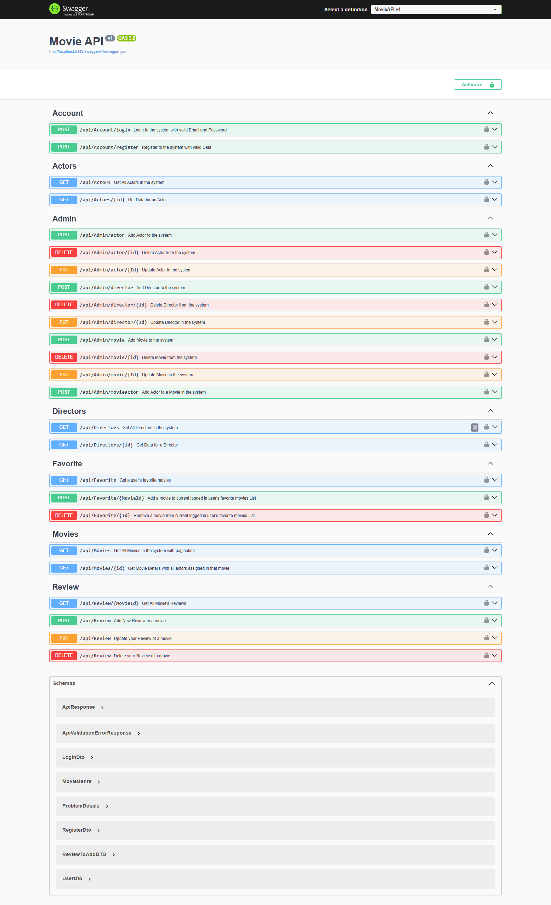

# 🎬 Movie API

A full-featured RESTful API for a Movie Database system built using **ASP.NET Core**, **Entity Framework Core**, and **SQL Server**, with **Redis** for caching. This API supports managing movies, actors, directors, user accounts, favorites, and reviews.

## 🚀 Features

- **Account Management**: Register and login endpoints.
- **Movie Management**: Add, update, delete, and fetch movies with actor assignments.
- **Actor & Director Management**: CRUD operations by Admin.
- **Favorites**: Users can manage their favorite movies.
- **Reviews**: Users can add, update, and delete reviews.
- **Caching**: Redis used for performance improvement.
- **Authentication**: Secured endpoints with authorization.
- **Swagger**: Fully documented using Swagger UI.
- **Pagination**: Support for movie list pagination.

---

## 🛠️ Tech Stack

- **Backend Framework**: ASP.NET Core Web API
- **ORM**: Entity Framework Core
- **Database**: SQL Server
- **Caching**: Redis
- **API Documentation**: Swagger (OpenAPI 3.0)
- **Authentication**: JWT 
- **Object Mapping**: AutoMapper 

---

## 📚 API Endpoints Overview

### 🔐 Account
- `POST /api/Account/login` - Login
- `POST /api/Account/register` - Register

### 🎭 Actors
- `GET /api/Actors` - Get all actors (Cached)
- `GET /api/Actors/{id}` - Get actor by ID
- `POST /api/Admin/actor` - Add actor
- `PUT /api/Admin/actor/{id}` - Update actor
- `DELETE /api/Admin/actor/{id}` - Delete actor

### 🎬 Movies
- `GET /api/Movies` - List movies (with pagination) (Cached)
- `GET /api/Movies/{id}` - Movie details
- `POST /api/Admin/movie` - Add movie
- `PUT /api/Admin/movie/{id}` - Update movie
- `DELETE /api/Admin/movie/{id}` - Delete movie
- `POST /api/Admin/movieactor` - Assign actor to movie

### 🎤 Directors
- `GET /api/Directors` - Get all directors (Cached)
- `GET /api/Directors/{id}` - Get director by ID
- `POST /api/Admin/director` - Add director
- `PUT /api/Admin/director/{id}` - Update director
- `DELETE /api/Admin/director/{id}` - Delete director

### ❤️ Favorites
- `GET /api/Favorite` - Get user's favorite movies
- `POST /api/Favorite/{movieId}` - Add favorite
- `DELETE /api/Favorite/{id}` - Remove favorite

### 📝 Reviews
- `GET /api/Review/{movieId}` - Get movie reviews
- `POST /api/Review` - Add review
- `PUT /api/Review` - Update review
- `DELETE /api/Review` - Delete review
####**API Endpoints:**

